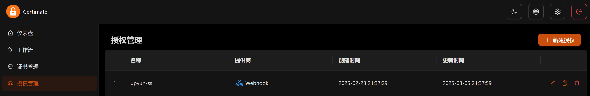
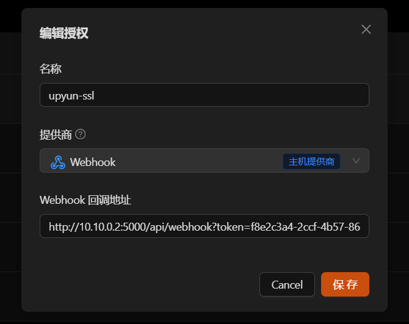
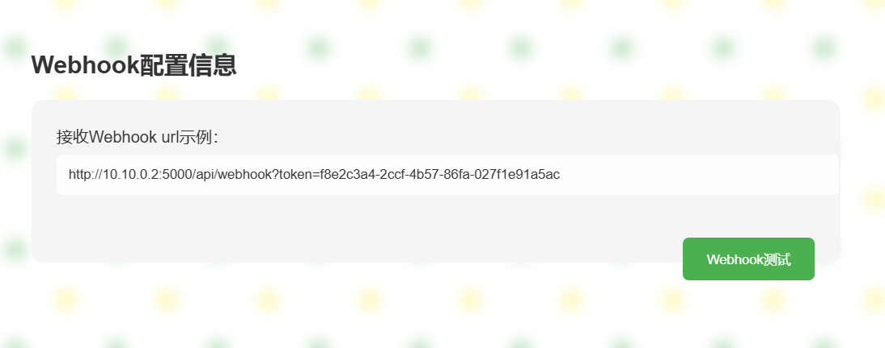

# upyun certificate 更新助手
## 说明
1. 于Certimate集成【webhook】更换upyun证书 
2. 对接upyun API接口上传证书 
3. 迁移CDN使用的证书


## 部署方式 by docker
```shell
docker pull hescc/upyun-ssl  # 拉取镜像
docker run -d --name upyun-ssl -p 5000:5000 --restart=unless-stopped hescc/upyun-ssl  # 运行upyun-ssl容器
```
访问upyun web服务：http://IP:5000

默认密码：admin/adminadmin

## Certimate配置




